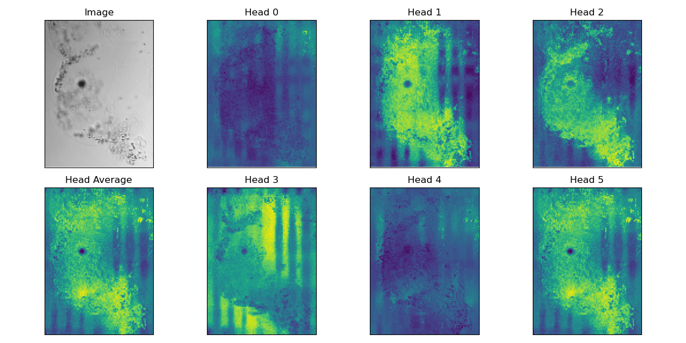

# Attention Visualization

## Description

Visualization of the six attention heads of the last attention layer and their average for one inpout image.

## Command

```
PYTHONPATH=/home/nkoreub/Documents/Projects/plankton-dinov2 torchrun --standalone --nnodes=1 --nproc_per_node=1 \
    dinov2/run/viz/attention.py \
    --pretrained-weights /home/nkoreub/Documents/Projects/plankton-dinov2/checkpoints/teacher_checkpoint.pth \
    --config-file dinov2/configs/viz/whoi.yaml \
    --output-dir /home/nkoreub/Documents/Projects/plankton-dinov2/output_dir/ \
    --img_path /home/nkoreub/Documents/Projects/plankton-dinov2/data/raw/WHOI/2011/Corethron/IFCB1_2011_255_203841_00052.png
```

## Config

```
visualization:
  max_size: 1800
```

`max_size`: max width/height (depending on aspect ratio of image) to which attention maps are upscaled

## Output Figure(s) or Data

Output is a figure with eight subplots. One subplot for the image, each attention head and their average.

### Example:



## Output Storage

The output figure is stored under `<output_dir>/<run_name>/figs/attention.png`